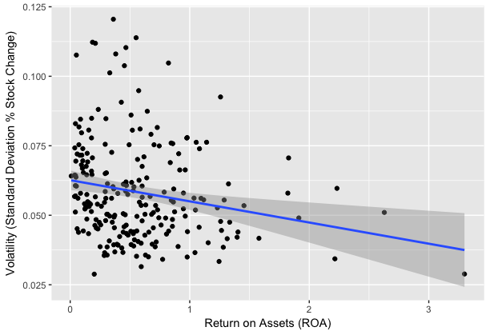

## Regression Analysis to Infer Stock Volatility in the COVID-19 Pandemic Using Companies Financial Ratios

## Summary
The purpose of this analysis is to determine if their are financial ratios that can be used to infer the risk and volatility of stock prices during the COVID-19 pandemic. In order to determine if certain financial ratios are correlated with stock volatility during the pandemic, a multiple linear regression analysis is performed using a DuPont framework. The DuPont framework is a financial equation that models the return on equity of a company using profitability, return on assets and leverage. for this analysis, the three financial ratios are the independent variables and stock volatility is the dependent variable. 

The analysis concludes that on average their is a negative correlation (.002 P-Value) between volatility and return on assets in a pandemic situation. This correlation indicates that as the return on assets ratio increases, the stock volatility decreases. Even though the model is significant, the model has a poor fit (.037 Adj R Square), which indicates that the majority of variability is unexplained and this model would likely not be useful for individual company predictions on volatility given that the model would likely give too large of a prediction interval range to be useful. Nevertheless, the model does provide insight on how on average, companies with high return on assets could be less risky and less volatility during a pandemic.

One speculation of stock volatility being less for companies that have a high return on assets, could be that stockholders may feel more confident in companies in a pandemic if the company is able to generate sales with their current assets. Potentially, stockholders are thinking that companies won't be able to buy additional assets in a worsen economy from a pandemic, so it is important for that company to be able to generate sales with their current assets. Another reason could be that industries that generally have high return on assets, like technology, could just happen to have more stockholder confidence. Overall, they tends to be less volatility in companies with high return on assets and further analysis should be done to determine if their are other financial ratios and data that can capture stock volatility during a pandemic.

Regression Plot of Correlation between Return on Assets and Stock Volatility

## Methology
Due to limitations of downloading stocks data, sporadic missing mapping data of CIK to stock ticket, and unstandardized financial statement data from sec, only data from S&P500 is in scoped of this analysis it. Furthermore, after the final data joining of S&P500 financial ratios data to stock data, there were only 233 companies with complete financial and stock data available for analysis. 

The financial ratios for DuPont framework are calculated by using the annual 10-K 2019 sec report data and parsing out net income, revenue, and stockholder equity financial measures for all companies. After calculating the financial ratios, the stock data is downloaded via tidyquant, which is from yahoo finance. In order to determine volatility, the standard deviation of percent change between 2020-03-01 and latest available data (2020-05-15). This time period is chosen to represent the pandemic (COVID-19) stock volatility. Furthermore, the sec data needed to be mapped the Central Index Key (CIK ) to a stock ticket in order to join stock volatility data with financial ratio data.

Outliers are removed by using filtering out any company with a cook distance of greater than 4/total company threshold. Removing high leverage points were also manually looked at to see if they should be removed due to them might be causing signficance, but removing them did not affect the significance of the model, so they were kept in. 

## Future Steps and Known Issues
Ideally, all the S&P500 data would be available for analysis, but due to the amount of variability of companies nomenclature of  financial measures, it is a heavy lift to analyze every company 10-K report to determine how to account for their nomenclature. Another issue is that is well known that it is difficult to compare financial ratios across industries, so accounting for the company industry could be a potential next step. Additionally, only 2019 10-K sec annual report is used to calculate the financial ratios, in the future, it might be useful to look at the financial ratios across time to better understand their impact on volatility.  Lastly, a piece wise regression might be give a more accurate picture on how volatility is correlated to return on assets, but choosing the breakpoints would need a deep analysis. 

## Appendix

## Data
Financial Statement Data
https://www.sec.gov/dera/data/financial-statement-data-sets.html

Stock Data  - tidyquant (Yahoo Finance)
https://cran.r-project.org/web/packages/tidyquant/vignettes/TQ01-core-functions-in-tidyquant.html#get-quantitative-data

CIK to Ticker Mapping
http://rankandfiled.com/#/data/tickers

S&P 500 Ticker List
https://datahub.io/core/s-and-p-500-companies#data

